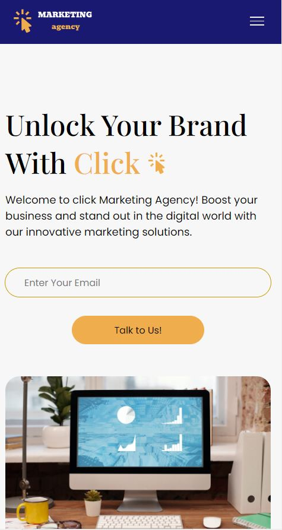
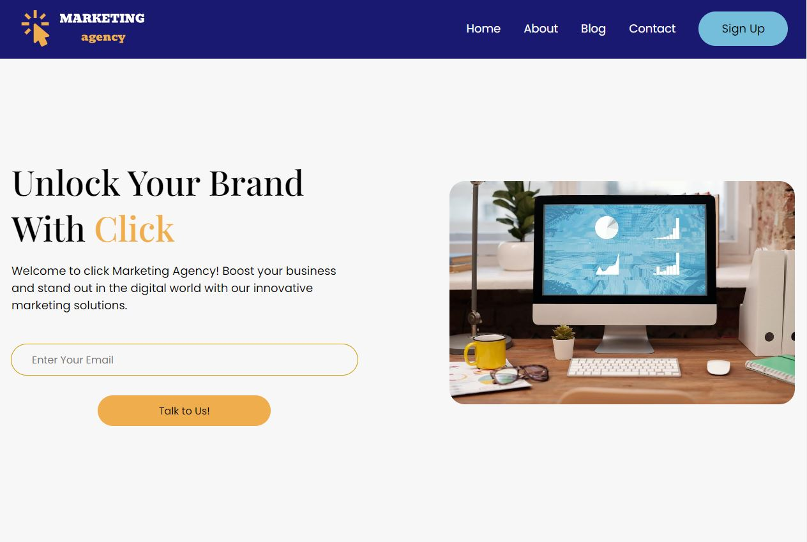

# Click Marketing Agency Website

## Table of Content

- [Click Marketing Agency Website](#click-marketing-agency-website)
  - [Table of Content](#table-of-content)
  - [Introduction](#introduction)
  - [Overview](#overview)
    - [Links](#links)
    - [Website Teach You](#website-teach-you)
    - [Build With](#build-with)
  - [Author](#author)
  - [Getting Started](#getting-started)
    - [Prerequisites](#prerequisites)
    - [Installation](#installation)
  - [License](#license)

## Introduction

Welcome to Click Marketing Agency Website project!

In this repository, we'll help you enhance your coding skills by creating real-world projects using HTML, CSS, and JavaScript. This README provides an overview of the project and step-by-step instructions for setting it up.

Let's get started!

## Overview


<!-- ### Screenshot

- Small screen: 
- large screen:  -->

### Links

- Source Code: [github](https://github.com/HirutAssefa/Click-Marketing-Agency-Website)

- Live Site URL: [Live Demo](https://Click-Marketing-Agency-Website.netlify.app/)

### Website Teach You

- Responsive layout
- CSS Flexbox
- CSS Grid
- SASS
- CSS Position Property
- Box model
- Mobile-first workflow
- Modern Design
- Javascript

### Build With


## Author

- Website - [HirutAssefa](https://HirutAssefa.github.io/Gebrekidan-portfolio/)

- Twitter - [@GebrekidanHirut](https://twitter.com/GebrekidanHirut)

## Getting Started

### Prerequisites

Before you begin, ensure you have met the following requirements:

- [Git](https://git-scm.com/downloads "Download Git") must be installed on your operating system.
- Basic knowledge of web development technologies, including HTML, CSS, JavaScript, Sass
- A code editor (e.g., Visual Studio Code) installed on your computer, below you can download Visual Studio Code editor.
- [Visual Studio Code Editor](https://code.visualstudio.com/download "Download VSCODE") must be installed on your operating system.
- A modern web browser for testing.

### Installation

1. Clone the repository:

Linux and macOS:

```bash
sudo git clone https://github.com/HirutAssefa/Click-Marketing-Agency-Website
```

Windows:

```bash
git clone https://github.com/HirutAssefa/Click-Marketing-Agency-Website
```

## License

This project is licensed under the MIT License - see the [LICENSE](LICENSE) file for details.
